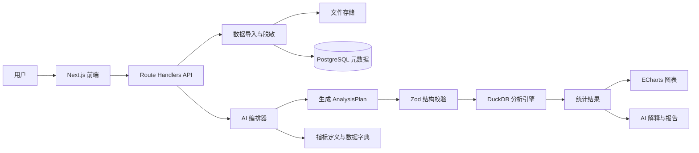

# AI 学生数据分析系统开发路线图

> 目标赛事：传智杯 AI WEB 网页开发挑战赛（赛道 10037）
>
> 选择方向：AI 数据分析与可视化
>
> 当前规划日期：2026-09-20
>
> 省赛作品提交截止：2026-11-18

## 1. 已确认的产品方向

### 1.1 产品定位

构建一个面向高校教学管理的 **AI 学生学习数据分析助手**。用户可以上传或选择学生学习数据，用自然语言提问，系统完成数据理解、统计分析、图表生成和结果解释。

产品不做成只有聊天框的通用 BI 工具，核心流程必须是：

```text
自然语言问题
  → 识别指标、维度、时间范围
  → 生成结构化分析计划
  → 校验字段与计算口径
  → 使用 DuckDB / SQL 实际计算
  → 生成图表
  → 输出可追溯的结论和报告
```

### 1.2 主要分析场景

- 学习参与度和课程访问行为分析；
- 成绩、作业提交和学习行为的关系分析；
- 学生退课或学习中断趋势分析；
- 课程、专业和学期之间的对比分析；
- 异常学习行为发现；
- 面向教学管理者的群体层面预警和改进建议。

系统输出以群体统计和趋势为主，不公开单个学生排名，也不自动替教师作出高影响决定。

### 1.3 适合比赛的差异化能力

建议把“分析可追溯”和“指标口径清晰”作为核心特色：

- 回答显示使用了哪些数据源和统计周期；
- 展示指标定义和计算公式；
- 展示生成并执行的只读查询；
- 发现问题口径不清时先追问，而不是直接猜一个数字；
- 对“相关关系”与“因果关系”明确区分。

这能同时支撑 AI 技术深度、Agent 工作流、RAG、AI 安全可控、创新性和用户体验评分。

## 2. 数据方案与合规边界

### 2.1 数据源优先级

| 优先级 | 数据源 | 用途 | 处理要求 |
| --- | --- | --- | --- |
| P0 | [OULAD](https://archive.ics.uci.edu/dataset/349/open+university+learning+analytics+dataset) | 主数据源，学习行为、成绩、注册和退课分析 | 使用数据页当前许可，README 中保留来源和引用；不尝试重新识别学生 |
| P0 | 仓库中的 `oulad_raw/` | 当前开发和验收数据 | 先用子集建立稳定 Demo，逐步增加数据量 |
| P1 | [UCI Student Performance](https://archive.ics.uci.edu/dataset/320/student+performance) | 成绩影响因素和预测补充场景 | 按数据页条款引用，核对当前许可 |
| P0 | 自建模拟校园数据 | 演示、测试和公开仓库 | 使用虚构学生编号，不对应真实人员 |
| P2 | 学校真实脱敏数据 | 提升本土场景真实性 | 必须取得学校授权，不能直接放入公开仓库 |

仓库当前已有以下数据资产：

- `oulad_raw/assessments.csv`
- `oulad_raw/studentRegistration.csv`
- `oulad_raw/vle.csv`
- `oulad_raw/courses.csv`
- `oulad_raw/studentVle.csv`
- `oulad_raw/studentInfo.csv`
- `oulad_raw/studentAssessment.csv`
- `scripts/verify_oulad.py`

### 2.2 建议的数据模型

把 OULAD 统一为分析友好的数据层：

| 表 | 主要内容 |
| --- | --- |
| `dim_student` | 匿名学生编号、非识别属性 |
| `dim_course` | 课程和开课期 |
| `dim_assessment` | 作业、考试、截止日期和权重 |
| `fact_activity` | 学习资源访问和点击行为 |
| `fact_assessment` | 成绩和提交时间 |
| `fact_registration` | 选课、注册和退课信息 |
| `dim_date` | 日期、周次、学期 |

开发初期可以直接用 DuckDB 读取 CSV；数据层稳定后再将元数据和常用聚合结果保存到 PostgreSQL。

### 2.3 合规规则

- 成绩、学号、联系方式、学习轨迹等属于个人信息，应按最小必要原则处理；
- 未经授权不得接入真实教务系统或公开真实学生记录；
- 真实数据只保留匿名 ID，按数据集使用独立盐值哈希；
- 原始文件、密钥和个人信息不得提交到 GitHub/Gitee；
- 发送给模型的内容优先是字段结构、聚合结果和必要样本，不发送不必要的逐行个人记录；
- 数据集中的文本内容视为不可信数据，不能把单元格里的指令当作系统指令执行。

## 3. 适合 AI 全程编码的系统架构

采用 **AI 友好的模块化单体**，不在第一版拆分微服务。这样代码上下文集中、接口数量少，AI 更容易生成和维护。



### 3.1 推荐技术栈

| 层 | 选型 | 目的 |
| --- | --- | --- |
| 前端与 API | Next.js 14+、TypeScript | 页面、接口和流式响应统一在一个应用中 |
| UI | Tailwind CSS、shadcn/ui | 快速生成一致的管理和分析界面 |
| 图表 | ECharts | 趋势、对比、分布、热力图和响应式图表 |
| 数据库 | Supabase PostgreSQL | 保存用户、数据集元数据、任务记录和配置 |
| 文件存储 | Supabase Storage 或 MinIO | 保存 CSV/Excel 原始文件 |
| 分析引擎 | DuckDB | 直接分析 CSV/Parquet，减少数据导入代码 |
| AI 接入 | Vercel AI SDK 或 OpenAI SDK | 流式输出和 Function Calling |
| 输出校验 | Zod | 校验 AI 生成的分析计划和图表配置 |
| 包管理 | pnpm | 统一脚本、依赖和构建流程 |
| 部署 | Docker Compose；可选 Vercel + Supabase | 保证演示环境可复现 |

### 3.2 推荐目录结构

```text
student-analytics/
├── app/                  # 页面、布局和 API Route Handlers
├── components/           # 数据上传、对话、图表和报告组件
├── lib/
│   ├── db/               # 数据库访问和迁移辅助
│   ├── analysis/         # DuckDB 查询、统计和结果校验
│   ├── ai/               # Prompt、工具、模型适配和流式输出
│   ├── charts/            # 图表类型和 ECharts 配置
│   └── security/          # 脱敏、权限、超时和查询限制
├── data/
│   ├── sample/            # 小型 OULAD 子集和模拟数据
│   └── schema/            # 数据字典和指标口径
├── supabase/
│   └── migrations/        # 数据库结构变更
├── docs/                  # 设计、评测和部署文档
└── package.json
```

### 3.3 AI 分析链路

模型不得直接执行任意 SQL，也不得直接凭语言模型计算数字。使用固定工具和白名单：

1. `profile_dataset`：识别字段、类型、缺失值和数据范围；
2. `retrieve_metric_definition`：检索指标定义、别名和计算口径；
3. `build_analysis_plan`：输出结构化 `AnalysisPlan`；
4. `validate_plan`：检查字段、指标、筛选条件和权限；
5. `run_analysis`：生成受限 SQL，由 DuckDB 执行；
6. `detect_anomaly`：对聚合结果做异常检测；
7. `create_chart`：生成 ECharts 配置；
8. `generate_report`：只根据真实计算结果生成解释和报告。

建议的核心类型：

```ts
type AnalysisPlan = {
  metric: "score" | "activity" | "completion_rate";
  dimensions: string[];
  filters: Record<string, string | number>;
  timeRange?: { start: string; end: string };
  chartType: "line" | "bar" | "heatmap" | "table";
};
```

## 4. 功能范围与优先级

### P0：省赛必须完成

- CSV/Excel 数据上传和数据集管理；
- 自动字段识别、缺失值和数据质量概览；
- 自然语言提问；
- 结构化分析计划和计划校验；
- DuckDB 实际统计计算；
- 折线图、柱状图、表格和热力图；
- 结果解释、数据来源、统计周期和 SQL 溯源；
- 失败时的人话提示、超时和空结果处理；
- 模拟数据和 OULAD 子集的稳定演示流程。

### P1：完成 P0 后加入

- 指标口径库和 RAG 检索；
- 口径不清时的选项卡片追问；
- 学习行为异常检测；
- 课程和学期对比；
- 分析报告导出为 Markdown 或 PDF；
- 流式输出和 AI 分析步骤展示。

### P2：有余力再做

- 报表截图识别；
- 语音提问；
- 主动洞察卡片；
- 分析路径保存和回放；
- 预测模型或更复杂的归因分析；
- MCP Server 封装数据库工具。

不要在 P0 稳定前加入多 Agent、复杂 MCP 或多个模型供应商。比赛作品首先需要可运行、可解释、可复现。

## 5. AI 编码工作方式

“All in AI code”仍然需要人工先确定边界。推荐按以下顺序执行：

1. 先写数据库表结构、`AnalysisPlan`、工具输入输出和错误格式；
2. 让 AI 先生成数据导入、字段分析和 DuckDB 查询模块；
3. 为分析模块准备固定样例输入、预期结果和失败用例；
4. 再生成 API、页面和图表组件；
5. 最后接入模型、Prompt、Function Calling 和流式 UI；
6. 每个模块完成后立即提交 Git，并记录生成代码的人工修改点；
7. 所有模型输出都经过 Zod 校验、权限校验和结果校验；
8. 不接受 AI 生成的任意代码执行、任意 SQL 或未经解释的预测结论。

建议在仓库中维护以下文档，作为 AI 编码上下文：

- `docs/architecture.md`：架构和数据流；
- `docs/data-dictionary.md`：字段含义和允许的分析维度；
- `docs/metric-definitions.yml`：指标口径；
- `docs/ai-tools.md`：工具参数、返回值和错误处理；
- `docs/demo-questions.md`：经过验证的演示问题和期望结果。

## 6. 开发时间表

按 2026-11-18 省赛提交截止倒排，预留至少 3 天缓冲：

| 阶段 | 时间 | 主要任务 | 退出标准 |
| --- | --- | --- | --- |
| 第 1 周 | 9/20–9/26 | 确认题目、初始化仓库、整理 OULAD 字段、建立模拟数据 | 能运行项目并展示数据集概览 |
| 第 2 周 | 9/27–10/3 | 完成数据导入、DuckDB 查询和基础图表 | “问题→统计结果→图表”闭环跑通 |
| 第 3 周 | 10/4–10/10 | 完成自然语言分析计划、Zod 校验和基础 AI 工具 | 10 个固定问题可稳定回答 |
| 第 4 周 | 10/11–10/17 | 加入指标口径库、追问和结果溯源 | 口径不明确的问题会先澄清 |
| 第 5 周 | 10/18–10/24 | 加入权限、只读查询、超时、行数限制和错误边界 | 恶意或越权查询会被拦截 |
| 第 6 周 | 10/25–10/31 | 完成异常检测、对比分析和流式交互 | 关键页面可连续演示 |
| 第 7 周 | 11/1–11/7 | 部署公网、补 UI、整理评测数据和演示账号 | 从空环境可部署并访问 |
| 第 8 周 | 11/8–11/14 | 录制视频、撰写技术文档、修复问题 | 视频和 PDF 初稿完成 |
| 缓冲期 | 11/15–11/18 | 最终回归、提交前检查 | 仓库、视频、文档和账号完整 |

每天至少保留一次有意义的 Git 提交，保持真实开发历史；每周更新一次 README 或技术文档。

## 7. 验收与评测指标

### 7.1 功能验收

- 至少准备 20 个固定问题，覆盖趋势、分组、对比、异常和时间筛选；
- P0 问题中至少 15 个能得到正确统计结果并生成合适图表；
- 对无字段、空结果、时间范围错误和权限不足给出明确反馈；
- 每个回答均可展开查看数据源、口径、SQL 和统计周期。

### 7.2 AI 质量验收

记录以下指标，而不是只展示“回答看起来不错”：

- 分析计划字段正确率；
- SQL 执行成功率；
- 统计结果与人工基准的差异；
- 图表类型选择正确率；
- 口径澄清触发准确率；
- 平均响应时间和单次模型成本。

### 7.3 评审材料验收

- 公开 GitHub/Gitee 仓库，包含完整提交历史；
- README 包含项目介绍、架构、安装运行、环境变量模板和团队信息；
- 5–8 分钟、1080p 以上 MP4 演示视频；
- 不超过 30 页的 PDF 技术文档；
- 可选的公网在线演示地址和评审账号；
- 公开仓库中不包含 API 密钥或真实学生个人信息。

## 8. 推荐演示流程

1. 上传 OULAD 子集，展示字段识别和数据质量概览；
2. 提问“哪些课程的学习参与度下降最多”，展示图表和可追溯 SQL；
3. 提问“哪些学生有退课风险”，展示群体统计和风险因素，不公开个人排名；
4. 提问一个缺少时间范围或口径不清的问题，展示 AI 先澄清再分析；
5. 展开指标定义、数据来源、统计周期和分析步骤；
6. 展示一个异常数据或查询失败场景，说明系统如何兜底；
7. 最后展示报告导出和公网部署结果。

## 9. 主要风险与处理

| 风险 | 处理方式 |
| --- | --- |
| AI 生成错误 SQL | 只允许白名单字段和只读查询，执行前 Zod/SQL 校验 |
| 模型编造数字 | 结论只能读取 DuckDB 返回结果，禁止直接从模型文本取数字 |
| OULAD 数据量较大 | 先用子集开发；稳定后用 DuckDB 直接查询 CSV/Parquet |
| 公开学生数据合规风险 | 优先使用匿名公开数据和模拟数据，不使用真实个人记录 |
| 功能范围过大 | 严格按 P0→P1→P2 实施，P0 未完成不扩展功能 |
| 部署临近截止出问题 | 第 7 周前完成第一次公网部署并保留备用部署方式 |
| 被认为是普通聊天 BI | 强化指标口径、分析溯源、结果校验和真实教育场景 |

## 10. 开工清单

- [ ] 建立公开代码仓库和分支规范；
- [ ] 运行 `scripts/verify_oulad.py`，确认本地数据可读；
- [ ] 从 OULAD 中制作可快速加载的小型样本；
- [ ] 写出数据库表结构和 `AnalysisPlan` 类型；
- [ ] 初始化 Next.js、TypeScript、Tailwind、shadcn/ui 和 pnpm；
- [ ] 完成第一个“固定问题→DuckDB→ECharts”页面；
- [ ] 建立 10–20 个演示问题和人工基准答案；
- [ ] 补充数据字典、指标定义和 AI 工具说明；
- [ ] 再接入模型和自然语言分析流程；
- [ ] 每完成一个可验证模块就提交 Git。

