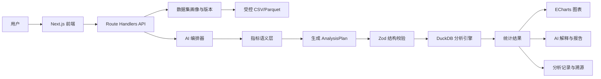

# AI 学生数据分析系统开发路线图

> 目标赛事：传智杯 AI WEB 网页开发挑战赛（赛道 10037）
>
> 选择方向：AI 数据分析与可视化
>
> 当前规划日期：2026-09-20
>
> 省赛作品提交截止：2026-11-18

## 1. 已确认的产品方向

### 1.1 产品定位

构建一个面向高校教学管理的 **AI 学生学习数据分析助手**。首个可交付版本聚焦一条可复现的垂直链路：模拟 CSV 或 OULAD 小样本 → 固定问题 → 结构化分析计划 → DuckDB 确定性计算 → 图表与可追溯结论。上传、自然语言扩展和更多数据源在这条链路稳定后再加入。

产品不做成只有聊天框的通用 BI 工具，核心流程必须是：

```text
自然语言问题
  → 识别指标、维度和可选筛选条件
  → 生成结构化分析计划
  → 校验字段与计算口径
  → 使用 DuckDB / SQL 实际计算
  → 生成图表
  → 输出可追溯的结论和报告
```

### 1.2 MVP 边界与主要分析场景

MVP 只承诺 3 个指标（平均成绩、活跃次数、完成率）、2 个维度（课程、学期）和 3 种展示方式（折线图、柱状图、表格），首批 10 个固定问题必须稳定通过。热力图、异常检测、个体风险和预测模型不属于首个垂直切片。

- P0：按课程或学期比较平均成绩、学习活跃次数和完成率；
- P1：加入时间筛选、学习行为异常和群体层面的趋势提示；
- P2：再评估成绩与行为关系、退课/中断趋势、预测模型和更复杂的归因分析。

系统只输出满足最小样本阈值的群体统计和趋势，不公开单个学生排名，不生成个体风险名单，也不自动替教师作出高影响决定。

### 1.2.1 图表表现升级路线

图表升级遵循“先保证读数准确，再增加视觉表现和交互”的顺序。大语言模型只从白名单中推荐图表类型，具体颜色、布局、坐标轴、提示框和动画由系统模板控制，不能让模型直接生成任意 ECharts 配置。

| 阶段 | 图表/组件 | 适用问题 | 数据要求与实现边界 |
| --- | --- | --- | --- |
| P0 | 柱状图 | 比较不同课程或学期的单项指标 | 当前 `dimension + value + sampleSize` 即可；必须显示单位、样本数、排序和空结果状态 |
| P0 | 折线图 | 查看学期或时间顺序上的变化 | 需要有序分组；暂不表达因果关系，不用平滑曲线掩盖真实波动 |
| P0 | 数据表格 | 核对具体数值、指标口径和样本数 | 支持排序、单位和数值精度；作为所有图表的可核对出口 |
| P1 | KPI 指标卡 | 展示平均成绩、完成率、总活跃次数等摘要 | 后端增加汇总值、变化值和统计周期；变化值没有可靠基准时不显示 |
| P1 | 分组柱状图 | 同时比较多个指标或多个时间段 | 结果需要返回 `series` 和统一单位；不同量纲不能直接放在同一坐标轴 |
| P1 | 面积图 | 强调活跃度随时间的总量变化 | 需要时间序列；面积只用于总量或单序列，避免堆叠造成误读 |
| P2 | 热力图 | 查看课程×学期、课程×周次等二维模式 | 需要两个维度和矩阵数据，不用当前单维结果强行拼接 |
| P2 | 散点图 | 探索活跃次数与成绩等两个数值变量的关系 | 需要聚合后的点集和样本量；只描述相关性，不下因果结论 |
| P2 | 箱线图 | 查看不同课程的成绩分布和离散程度 | 需要分位数、四分位距和异常值规则，不能只用平均值生成 |
| P2 | 雷达图/桑基图 | 多指标概览或学习流程展示 | 仅在指标可比、流程数据完整时使用；不作为默认图表 |

统一视觉要求：响应式布局、有限且有语义的配色、清晰的图例和单位、悬停详情、加载/空数据/错误状态、键盘可访问的表格替代视图，以及不过度的动画。图表标题必须说明指标和分组维度，不能只显示“分析结果”。

### 1.3 适合比赛的差异化能力

建议把“分析可追溯”和“指标口径清晰”作为核心特色：

- 回答显示使用了哪些数据源和统计周期；
- 展示指标定义和计算公式；
- 展示生成并执行的只读查询；
- 发现问题口径不清时先追问，而不是直接猜一个数字；
- 对“相关关系”与“因果关系”明确区分。

这能同时支撑 AI 技术深度、Agent 工作流、RAG、AI 安全可控、创新性和用户体验评分。

### 1.4 参考案例复盘后的冻结决策

已经对照学习分析和 GenBI 开源项目复核方案，吸收的是设计原则，不引入这些项目作为运行时依赖：

| 案例启发 | 本项目的落地决策 |
| --- | --- |
| Learning Trace Platform 的教师/学生双视角 | 首期只做教学管理者的群体分析视图；建议必须来自真实聚合结果，不做个体画像 |
| Open edX Engagement Analytics 的日志 → ETL → 数据集市 | OULAD 先整理成逻辑维表/事实表和 DuckDB 查询视图；不在截止日前引入 ClickHouse |
| Moodle Learning Analytics 的隐私和能力控制 | 保留最小样本阈值、只读分析和审计信息；上传或多用户后再加入角色权限 |
| 紫金学院的自然语言意图识别 | AI 只负责识别指标、维度和澄清问题，不提供增删改工具，不让模型直接访问数据库 |
| WrenAI 的语义层和可审查上下文 | 将指标定义、别名、粒度、公式和示例作为版本化 YAML/Markdown 资产，先实现轻量检索，不引入完整 GenBI 平台 |

这些决策构成提交版本的产品边界：**可复现的群体学习分析 + 版本化指标语义 + 受控计划 + 确定性计算 + 可追溯结果**。

## 2. 数据方案与合规边界

### 2.1 数据源优先级

| 优先级 | 数据源 | 用途 | 处理要求 |
| --- | --- | --- | --- |
| P0 | [OULAD](https://archive.ics.uci.edu/dataset/349/open+university+learning+analytics+dataset) | 主数据源，学习行为、成绩、注册和退课分析 | 使用数据页当前许可，README 中保留来源和引用；不尝试重新识别学生 |
| P0 | 仓库中的 `oulad_raw/` | 当前开发和验收数据 | 先用子集建立稳定 Demo，逐步增加数据量 |
| P1 | [UCI Student Performance](https://archive.ics.uci.edu/dataset/320/student+performance) | 成绩影响因素和预测补充场景 | 按数据页条款引用，核对当前许可 |
| P0 | 自建模拟校园数据 | 演示、测试和公开仓库 | 使用虚构学生编号，不对应真实人员 |
| P2 | 学校真实脱敏数据 | 提升本土场景真实性 | 必须取得学校授权，不能直接放入公开仓库 |

本地开发目录可放置以下数据资产（CSV 已被 `.gitignore` 排除，不提交到公开仓库）：

- `oulad_raw/assessments.csv`
- `oulad_raw/studentRegistration.csv`
- `oulad_raw/vle.csv`
- `oulad_raw/courses.csv`
- `oulad_raw/studentVle.csv`
- `oulad_raw/studentInfo.csv`
- `oulad_raw/studentAssessment.csv`

### 2.2 建议的数据模型

把 OULAD 统一为分析友好的数据层：

| 表 | 主要内容 |
| --- | --- |
| `dim_student` | 匿名学生编号、非识别属性 |
| `dim_course` | 课程和开课期 |
| `dim_assessment` | 作业、考试、截止日期和权重 |
| `fact_activity` | 学习资源访问和点击行为 |
| `fact_assessment` | 成绩和提交时间 |
| `fact_registration` | 选课、注册和退课信息 |
| `dim_date` | 日期、周次、学期 |

提交版本固定使用本地 CSV/Parquet 加 DuckDB；`dim_*`、`fact_*` 和常用聚合是 DuckDB 中的逻辑视图或查询模板，不要求先建设 PostgreSQL。只有在比赛后需要多用户、长期任务和在线上传时，才评估 PostgreSQL、对象存储或 ClickHouse。

### 2.3 指标语义层与分析记录

每个指标在 `docs/metric-definitions.yml` 中至少登记：稳定 ID、中文名称、别名、公式、输入表、数据粒度、时间语义、允许维度、最小样本阈值、单位、隐私说明和金标准查询编号。指标定义的版本号随分析结果保存，避免同一个词在不同版本中产生不同口径。

每次分析保存一条不含原始个人记录的分析记录：数据集版本、指标版本、规范化 `AnalysisPlan`、结果摘要、查询耗时、模型来源（固定案例/模型/无模型）和错误码。这样可以复现结果，也能在演示中解释系统为什么得出结论。

### 2.4 数据粒度与指标金标准

- `fact_activity` 的粒度是“学生-课程-开课期-日期-资源”，复合键为 `id_student + code_module + code_presentation + date + id_site`；
- `fact_assessment` 的粒度是“学生-课程-开课期-考核项”，复合键为 `id_student + id_assessment`，连接考核项时必须同时校验课程和开课期；
- `fact_registration` 的粒度是“学生-课程-开课期-注册事件”，退课日期为空表示未退课；
- 每个指标都要有金标准 SQL、连接键、去重规则、时间语义和成绩归一化说明，禁止直接跨事实表连接后再聚合。

### 2.5 合规规则

- 成绩、学号、联系方式、学习轨迹等属于个人信息，应按最小必要原则处理；
- 未经授权不得接入真实教务系统或公开真实学生记录；
- 真实数据只保留匿名 ID，按数据集使用独立盐值哈希；
- 原始文件、密钥和个人信息不得提交到 GitHub/Gitee；
- 发送给模型的内容优先是字段结构、聚合结果和必要样本，不发送不必要的逐行个人记录；
- 数据集中的文本内容视为不可信数据，不能把单元格里的指令当作系统指令执行。

## 3. 适合 AI 全程编码的系统架构

采用 **AI 友好的模块化单体**，不在第一版拆分微服务。这样代码上下文集中、接口数量少，AI 更容易生成和维护。



### 3.1 推荐技术栈

提交版本固定为 Docker Compose + Node.js 服务 + DuckDB + 持久化卷，保证原生依赖、文件和长查询行为可复现。Vercel、Supabase、MinIO、ClickHouse 只记录为赛后演进方向，不进入截止日前的主链路。

| 层 | 选型 | 目的 |
| --- | --- | --- |
| 前端与 API | Next.js 14+、TypeScript | 页面、接口和流式响应统一在一个应用中 |
| UI | Tailwind CSS、shadcn/ui | 快速生成一致的管理和分析界面 |
| 图表 | ECharts | 趋势、对比、分布、热力图和响应式图表 |
| 元数据与分析记录 | DuckDB/JSONL 文件 | 保存数据集画像、指标版本、分析计划和审计摘要；避免为比赛引入第二套数据库 |
| 文件存储 | 本地受控目录和 Docker 持久化卷 | 保存演示 CSV/Parquet；上传能力稳定后再评估对象存储 |
| 分析引擎 | DuckDB | 直接分析 CSV/Parquet，承担事实表视图和确定性聚合 |
| AI 接入 | Vercel AI SDK 或 OpenAI SDK | 流式输出和 Function Calling |
| 输出校验 | Zod | 校验 AI 生成的分析计划和图表配置 |
| 包管理 | pnpm | 统一脚本、依赖和构建流程 |
| 部署 | Docker Compose | 作为唯一提交部署方式，确保 DuckDB 原生依赖可用 |

### 3.2 推荐目录结构

```text
student-analytics/
├── app/                  # 页面、布局和 API Route Handlers
├── components/           # 数据上传、对话、图表和报告组件
├── lib/
│   ├── db/               # 数据库访问和迁移辅助
│   ├── analysis/         # DuckDB 查询、统计和结果校验
│   ├── ai/               # Prompt、工具、模型适配和流式输出
│   ├── charts/            # 图表类型和 ECharts 配置
│   └── security/          # 脱敏、权限、超时和查询限制
├── data/
│   ├── sample/            # 小型 OULAD 子集和模拟数据
│   └── schema/            # 数据字典和指标口径
├── records/               # 分析记录和数据集版本元数据
├── docs/                  # 设计、评测和部署文档
└── package.json
```

### 3.3 AI 分析链路

模型不得直接执行任意 SQL，也不得直接凭语言模型计算数字。提交版本只允许“问题 → 语义检索 → `AnalysisPlan` → 固定查询模板 → DuckDB”；受限 SQL 生成器列为赛后实验，不进入 P0/P1。每次查询必须经过字段/操作符白名单、数据集权限校验、超时、内存和返回行数限制。上传文件还需限制大小和格式，拒绝压缩包路径穿越、公式注入和异常编码；API 需限流并设置模型成本上限。

1. `profile_dataset`：识别字段、类型、缺失值和数据范围；
2. `retrieve_metric_definition`：检索指标定义、别名和计算口径；
3. `build_analysis_plan`：输出结构化 `AnalysisPlan`；
4. `validate_plan`：检查字段、指标、筛选条件和权限；
5. `run_analysis`：根据已校验计划选择固定 SQL 模板，由 DuckDB 执行；
6. `create_chart`：生成 ECharts 配置；
7. `generate_report`：只根据真实计算结果生成解释和报告；
8. `detect_anomaly`（P1）：只对聚合结果做群体层面的异常检测。

建议的核心类型：

```ts
type AnalysisPlan = {
  version: 1;
  datasetId: string;
  metric: "score" | "activity" | "completion_rate";
  aggregation: "avg" | "sum" | "count_distinct" | "rate";
  dimensions: ("course" | "term")[];
  filters: Array<{ field: "course" | "term"; op: "eq" | "in"; value: string | string[] }>;
  sort?: { by: "value" | "dimension"; direction: "asc" | "desc" };
  limit: number;
  chartType: "line" | "bar" | "table";
};
```

## 4. 功能范围与优先级

### P0：省赛必须完成

P0 的最小垂直切片是“模拟 CSV/OULAD 子集 → 10 个固定问题 → AnalysisPlan → DuckDB → 图表 → 来源、口径、SQL 和统计周期”。上传、Excel、热力图和异常检测必须在垂直切片稳定后再加入。

- 预置模拟 CSV/OULAD 小样本和数据集选择；
- 自动字段识别、缺失值和数据质量概览；
- 10 个固定问题（自然语言接入作为稳定链路后的适配层）；
- 最小指标语义层：指标定义、别名、粒度、公式、阈值和版本号；
- 结构化分析计划和计划校验；
- DuckDB 实际统计计算；
- 折线图、柱状图和表格三种展示方式，并完成统一的现代化视觉模板；
- 结果解释、数据来源、统计周期和 SQL 溯源；
- 分析记录：数据集版本、指标版本、计划、结果摘要和错误码；
- 失败时的人话提示、超时和空结果处理；
- 模拟数据和 OULAD 子集的稳定演示流程。

### P1：完成 P0 后加入

- CSV/Excel 上传和数据集版本管理；
- 时间范围、课程/学期筛选和口径澄清卡片；
- 指标口径库的检索增强（只返回允许的定义和示例）；
- 口径不清时的选项卡片追问；
- KPI 指标卡、分组柱状图和面积图；
- 图表与表格联动、悬停详情和课程/学期筛选；
- 群体层面的学习行为异常检测；
- 分析报告导出为 Markdown 或 PDF；
- 流式输出和 AI 分析步骤展示。

### P2：有余力再做

- 报表截图识别；
- 语音提问；
- 主动洞察卡片；
- 分析路径保存和回放；
- 热力图、散点图、箱线图以及多图联动仪表盘；
- 预测模型、个体风险名单或更复杂的归因分析；
- MCP Server 封装数据库工具。

不要在 P0 稳定前加入多 Agent、复杂 MCP 或多个模型供应商。比赛作品首先需要可运行、可解释、可复现。

## 5. AI 编码工作方式

“All in AI code”仍然需要人工先确定边界。推荐按以下顺序执行：

1. 先写数据库表结构、`AnalysisPlan`、工具输入输出和错误格式；
2. 让 AI 先生成数据导入、字段分析和 DuckDB 查询模块；
3. 为分析模块准备固定样例输入、预期结果和失败用例；
4. 再生成 API、页面和图表组件；
5. 最后接入模型、Prompt、Function Calling 和流式 UI；
6. 每个模块完成后立即提交 Git，并记录生成代码的人工修改点；
7. 所有模型输出都经过 Zod 校验、权限校验和结果校验；
8. 不接受 AI 生成的任意代码执行、任意 SQL 或未经解释的预测结论。

建议在仓库中维护以下文档，作为 AI 编码上下文：

- `docs/architecture.md`：架构和数据流；
- `docs/data-dictionary.md`：字段含义和允许的分析维度；
- `docs/metric-definitions.yml`：指标口径；
- `docs/ai-tools.md`：工具参数、返回值和错误处理；
- `docs/demo-questions.md`：经过验证的演示问题和期望结果。

## 6. 开发时间表

按 2026-11-18 省赛提交截止倒排，预留至少 3 天缓冲：

| 阶段 | 时间 | 主要任务 | 退出标准 |
| --- | --- | --- | --- |
| 第 1 周 | 9/20–9/26 | 固定 MVP 指标/维度，初始化项目，建立模拟数据、数据字典和最小指标库 | Docker 可启动，展示数据集概览；指标口径已冻结 |
| 第 2 周 | 9/27–10/3 | 完成 DuckDB 固定查询模板、结果 schema、折线/柱状图、表格和第一版溯源 | “固定问题→统计结果→图表→SQL”闭环跑通，并完成一次最小部署 |
| 第 3 周 | 10/4–10/10 | 完成 AnalysisPlan v1、指标语义层、Zod/权限校验和 10 个 golden cases | 10 个固定问题稳定回答，数值与人工基准一致，指标版本随结果返回 |
| 第 4 周 | 10/11–10/17 | 加入分析记录、口径澄清、空结果/错误边界、最小样本阈值和恶意输入用例 | 每次分析可复现；口径不明确时先澄清；越权请求被拒绝 |
| 第 5 周 | 10/18–10/24 | 完成计划权限校验、固定查询模板检查、超时/内存/行数限制、限流和成本上限 | 安全测试用例全部通过，查询不会执行任意语句 |
| 第 6 周 | 10/25–10/31 | 在 P0 稳定后加入 KPI 指标卡、分组柱状图、面积图、图表与表格联动，再加入异常检测和流式交互 | 核心页面可连续演示，P1 图表可独立关闭 |
| 第 7 周 | 11/1–11/7 | 固化部署脚本、备用部署、评测报告和演示账号，补 UI | 从空环境可部署，P95 响应时间和成本达标 |
| 第 8 周 | 11/8–11/14 | 录制视频、撰写技术文档、全量回归和问题修复 | 视频和 PDF 初稿完成，golden cases 无回归 |
| 缓冲期 | 11/15–11/18 | 最终回归、提交前检查 | 仓库、视频、文档和账号完整 |

按可验证产物提交 Git：可运行用例、golden case、数据字典、查询模板或安全测试均可作为当天提交内容；不以提交次数作为质量指标。每周更新一次 README 或技术文档。

## 7. 验收与评测指标

### 7.1 功能验收

维护 `golden_cases`：每条记录包含问题、预期 AnalysisPlan、预期查询语义、结果容差、图表类型和失败场景。

- 准备 20 条回归用例：10 条 P0 正常问题，10 条口径不清、越权、空结果、非法筛选或数据缺失问题；
- 10 条 P0 正常问题全部得到正确统计结果并生成合适图表，10 条边界用例全部返回预期澄清或错误码；
- 分析计划字段准确率 ≥ 90%，SQL 执行成功率 ≥ 95%，数值误差 ≤ 1%，口径澄清触发准确率 ≥ 85%；
- P95 响应时间、单次模型成本和并发上限在部署文档中明确并通过验收；
- 对无字段、空结果、时间范围错误和权限不足给出明确反馈；
- 每个回答均可展开查看数据源、数据集版本、指标版本、口径、SQL 和统计周期；分析记录中不保存原始个人行。

### 7.2 AI 质量验收

记录以下指标，而不是只展示“回答看起来不错”：

- 分析计划字段正确率；
- SQL 执行成功率；
- 统计结果与人工基准的差异；
- 图表类型选择正确率；
- 图表与数据结构匹配率；
- 图表在桌面和窄屏下的可读性、表格替代视图和空状态验收；
- 口径澄清触发准确率；
- 平均响应时间和单次模型成本。

AI 未配置时，10 条 P0 固定问题仍必须完整通过；模型质量指标只在配置模型后统计，不能成为本地演示的单点依赖。

### 7.3 评审材料验收

- 公开 GitHub/Gitee 仓库，包含完整提交历史；
- README 包含项目介绍、架构、安装运行、环境变量模板和团队信息；
- 5–8 分钟、1080p 以上 MP4 演示视频；
- 不超过 30 页的 PDF 技术文档；
- 可选的公网在线演示地址和评审账号；
- 公开仓库中不包含 API 密钥或真实学生个人信息。

## 8. 推荐演示流程

1. 选择模拟校园数据或已准备好的 OULAD 子集，展示字段识别和数据质量概览；
2. 提问“比较各课程学习活跃次数”，展示图表和可追溯 SQL；
3. 提问“哪些课程完成率最高”，展示群体统计和最小样本阈值，不展示个体名单；
4. 提问一个缺少指标或分组口径的问题，展示 AI 先澄清再分析；
5. 展开指标定义、数据集版本、统计周期和分析步骤；
6. 展示一个空结果或非法请求，说明系统如何返回可理解的错误；
7. 最后展示 Docker 启动、固定问题无模型运行和分析记录结果。报告导出、在线上传和公网部署只有在 P1 完成后才展示。

## 9. 主要风险与处理

| 风险 | 处理方式 |
| --- | --- |
| AI 生成错误 SQL | 只允许白名单字段和只读查询，执行前 Zod/SQL 校验 |
| 模型编造数字 | 结论只能读取 DuckDB 返回结果，禁止直接从模型文本取数字 |
| OULAD 数据量较大 | 先用子集开发；稳定后用 DuckDB 直接查询 CSV/Parquet |
| 公开学生数据合规风险 | 优先使用匿名公开数据和模拟数据，不使用真实个人记录 |
| 功能范围过大 | 严格按 P0→P1→P2 实施，P0 未完成不扩展功能 |
| 部署临近截止出问题 | 第 2 周末完成最小部署，第 7 周固化主/备用部署并演练空环境恢复 |
| 被认为是普通聊天 BI | 强化指标口径、分析溯源、结果校验和真实教育场景 |
| 路线图与实际能力不一致 | 每周以 `docs/demo-questions.md`、`AnalysisPlan` schema 和可运行测试为准，删除未实现的演示承诺 |
| 跨事实表连接造成重复统计 | 先按事实表粒度聚合，再通过维度键连接；每个指标必须有金标准 SQL 和重复行测试 |
| 参考项目许可证不清晰 | 未声明许可证的仓库只用于学习交互和架构，不复制代码；复用前记录许可证和来源 |

## 10. 基础设施与赛事核验

第 1–2 周同时完成数据集版本约定、健康检查、错误监控、演示账号初始化、日志脱敏、分析记录备份/恢复演练和部署回滚脚本；第 7 周前完成主/备用环境恢复演练。赛事提交格式、视频时长、技术限制、评分项和截止时间以官方公告为准，提交前逐项核验并把链接和核验日期记录在 `docs/competition-checklist.md`。

## 11. 最终冻结方案

省赛提交版本按以下方案实施，不再在截止日前切换基础设施或扩大数据范围：

1. **数据**：模拟校园 CSV + OULAD 可复现子集；字段画像、缺失值和数据集版本由服务端生成。
2. **计算**：Next.js Route Handler 调用 DuckDB；事实表先按自身粒度聚合，SQL 由固定模板产生，模型永远不提交 SQL。
3. **AI**：固定问题走 golden case；其他问题只生成受限 `AnalysisPlan` 或澄清问题；AI 未配置时核心演示仍可运行。
4. **产品**：群体统计、三项指标、课程/学期维度、柱状图/折线图/表格、统一视觉模板、指标口径和 SQL 溯源；不做个体名单和高影响决策。KPI 卡、分组柱状图、面积图及更复杂图表按 P1/P2 逐步加入。
5. **工程**：Docker Compose 是唯一提交部署方式；分析记录保存计划、版本、结果摘要和错误码，不保存原始个人行。
6. **验收**：10 条正常 golden cases + 10 条边界用例全部通过，`pnpm typecheck`、`pnpm test`、`pnpm build` 和空环境启动均通过。

PostgreSQL、对象存储、ClickHouse、通用 Text-to-SQL、预测模型、个体风险、语音和 MCP 均作为赛后路线，不得挤占提交版本的稳定性工作。

## 12. 开工清单

- [ ] 建立公开代码仓库和分支规范；
- [ ] 校验 OULAD 本地文件的完整性和字段结构；
- [ ] 从 OULAD 中制作可快速加载的小型样本；
- [ ] 写出逻辑事实/维表、分析记录 schema 和 `AnalysisPlan` 类型；
- [ ] 初始化 Next.js、TypeScript、Tailwind、shadcn/ui 和 pnpm；
- [ ] 完成第一个“固定问题→DuckDB→ECharts”页面；
- [ ] 固化 P0 图表模板：柱状图、折线图、表格，并覆盖单位、样本数、空状态和窄屏布局；
- [ ] P1 增加 KPI 卡、分组柱状图、面积图和图表/表格联动；
- [ ] 建立 10 个 MVP golden cases，记录预期计划、结果容差和图表类型；
- [ ] 补充数据字典、指标定义和 AI 工具说明；
- [ ] 在固定查询链路稳定后再接入模型和自然语言分析流程；
- [ ] 每完成一个可验证模块就提交 Git。
